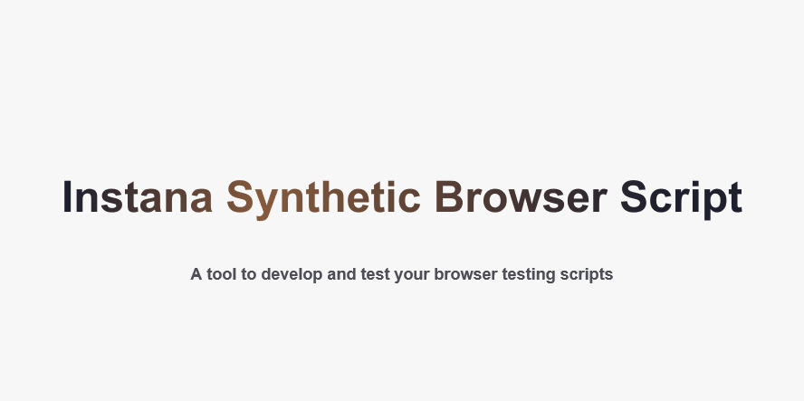
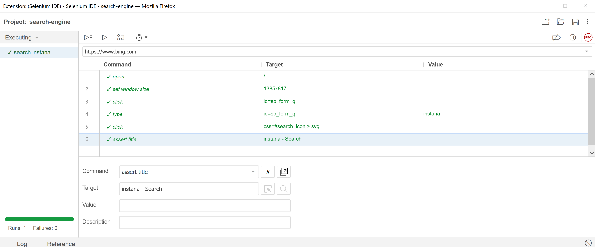
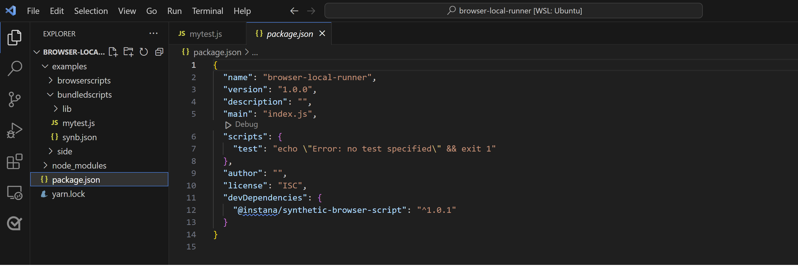
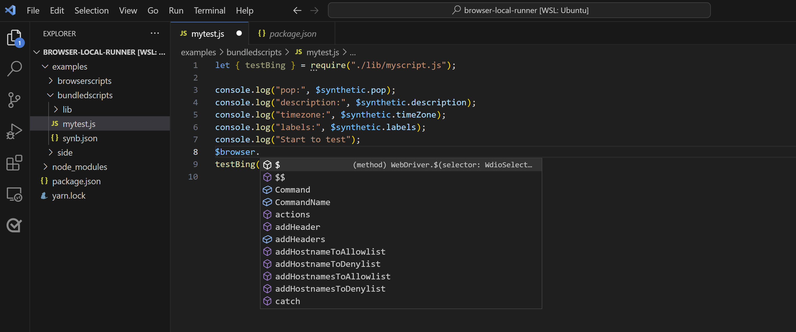
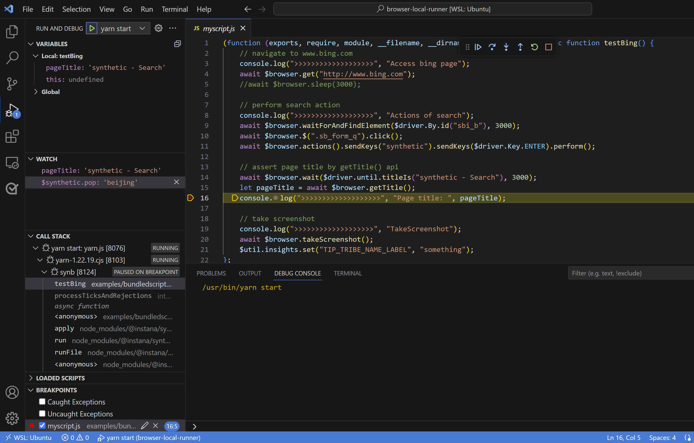

# Instana Synthetic Browser Script

[](https://www.npmjs.com/package/%40instana/synthetic-browser-script)
[](https://www.selenium.dev/selenium/docs/api/javascript/module/selenium-webdriver/lib/webdriver_exports_WebDriver.html)

[](https://www.ibm.com/docs/en/instana-observability/current?topic=monitoring-using-browser-scripts)


- [Instana Synthetic Browser Script](#instana-synthetic-browser-script)
      - [Homepage • Developer Guide • API Reference •](#homepage--developer-guide--api-reference-)
  - [🍀 Pre-requisite](#-pre-requisite)
      - [1. Supported Platforms](#1-supported-platforms)
      - [2. Install Node.js Server](#2-install-nodejs-server)
  - [🚀 Get started in 60 seconds](#-get-started-in-60-seconds)
      - [1. Install Synthetic-browser-script from NPM](#1-install-synthetic-browser-script-from-npm)
      - [2. Run a Demo Test](#2-run-a-demo-test)
  - [🌟 Test with CLI](#-test-with-cli)
      - [Test with CLI Options](#test-with-cli-options)
      - [Use Proxy in Local ENV](#use-proxy-in-local-env)
  - [🎉 Create Synthetic Test in Instana](#-create-synthetic-test-in-instana)
  - [🚤 Develop in IDE](#-develop-in-ide)
  - [🎯 Debugging with VS Code](#-debugging-with-vs-code)
  - [🫶 Frequently Asked Questions](#-frequently-asked-questions)
    - [Examples Used to Create Synthetic Tests](#examples-used-to-create-synthetic-tests)
    - [Best Practice and Frequently Asked Questions](#best-practice-and-frequently-asked-questions)
  - [Licence](#licence)


#### [Homepage](https://www.ibm.com/docs/en/instana-observability/current?topic=instana-synthetic-monitoring) &bullet; [Developer Guide](https://www.ibm.com/docs/en/instana-observability/current?topic=monitoring-using-browser-scripts) &bullet; [API Reference](https://www.ibm.com/docs/en/instana-observability/current?topic=scripts-browser-api-reference) &bullet;

This is a local runner can accelerate your Synthetic browser testing on-boarding. It provides totally the same testing results as Instana Synthetic thus can save your time in developing and testing Synthetic scripts locally. As a script writer you may have following requirements:

💡 a local runner to test and debug my scripts locally with CLI<br>
💡 a npm package providing all the Instana Synthetic browser testing APIs<br>
💡 "code completion" or "code hinting" in VS Code for all the browser testing APIs<br>
💡 open full browser to perform my test actions to convince me of the quality of my scripts<br>
💡 reproduce my test failures locally to help me debug root cause<br>
💡 examples to demonstrate how to use browser testing APIs thus I can write my own ones on top of them

[Synthetic-browser-script](https://www.npmjs.com/package/%40instana/synthetic-browser-script) is now available in the public NPM channel.

**Supported runtime**

Chromium, Mozilla Firefox, Node.js runtime.

☑️ Google Chrome / Chromium<br>
☑️ Mozilla Firefox<br>
☑️ Node.js v18.x<br>
☑️ selenium-webdriver v4.20.0


## 🍀 Pre-requisite
#### 1. Supported Platforms
macOS and Linux are supported by default. You can skip this step if you are using macOS or Linux.
To set up your environment in Windows, you can install WSL 2 and then install any Linux distribution (i.e. Ubuntu).
1. Follow [steps](https://learn.microsoft.com/en-us/windows/wsl/install) as described in the Windows Subsystem for Linux Setup.
2. Install an [X Server and test GUI support](https://nirisarri.github.io/2020-11-03-how-to-install-and-run-intellij-idea-for-linux-in-wsl2/).
In case `xeyes` doesn't work: check the inbound rules for `VcXsrv` windows server (Windows Security - Firewall & network protection - Advanced settings - Inbound rules). Allow the traffic for TCP protocol and restrict the Scope by including only your local IP address.
3. Install chrome or chromium in your WSL 2 Linux.

The rest of the steps described in this document can now be performed on your Linux distribution.

#### 2. Install Node.js Server

You can use [nvm](https://github.com/nvm-sh/nvm#installing-and-updating) to install Node.js if you don't have one.

Node.js v18 is recommended. 

```bash
nvm install v18.19.1

node --version
v18.19.1

# if you have multiple versions of Node.js installed, you can switch Node.js version with nvm
nvm list
nvm alias default v18.19.1
nvm use v18.19.1
```

## 🚀 Get started in 60 seconds

#### 1. Install Synthetic-browser-script from NPM

Initialize a new project with default values if you don't have one. 

It is recommended to create a project folder as a new Node.js project. 
Then you can put all your scripts under this Node.js project or sub-folders, develop and maintain your scripts continuously. 
Firstly, assuming that your project folder is `browser-local-runner`, you will install `@instana/synthetic-browser-script` package under your Node.js project as a dependency following the instructions below. 
Secondly, you can put your first script in the sub-folder e.g. `test-ibm-website`. 
Then you get all the test results in this sub-folder including screenshots, browser logs, HAR file, videos if generated after running your script with the local runner. 
```bash
# create a folder for your Node.js project as your working directory
cd browser-local-runner
# use npm init to initialize 
npm init
```

From your existing project's root dir:
```bash
# npm local install
npm install @instana/synthetic-browser-script --save-dev

# yarn local install
yarn add -D @instana/synthetic-browser-script
```
To run the command-line and verify the installation, use `npx synb --help`. Global installation is not recommended.

#### 2. Run a Demo Test

Synthetic-browser-script comes with useful command line options and rich examples, which are automatically copied to `node_modules/@instana/synthetic-browser-script/examples` during installation and can also be used as boilerplate to write your own tests on top of them.

When you use local installation, you can run the command-line application with `npx synb --help`.

You can run `--help` and follow the instructions given at the console output. Use `--version` or `-v` to ensure it is the latest version.
```bash
# list all the command-line options 
npx synb --help

# check the current version
npx synb --version
``` 

Use CLI `npx synb` to execute. 
Use `-b` to specify the browser type (chrome is by default without this option).
Use `-f` to specify the entry point of the javascript test scripts. 

```bash
# copy examples
cp -r node_modules/@instana/synthetic-browser-script/examples .

# run bundled browser test scripts
npx synb -b chrome -f examples/bundledscripts/mytest.js
```

Execution logs will be shown in console output. 
All the test results including HAR file, videos, screenshots, browser log can be found in the same directory of your test script.

## 🌟 Test with CLI
#### Test with CLI Options
Create a folder for your test scripts and use `-f, --file` to specify the entry point of the test scripts. The test results will be put in the same folder. Synthetic-browser-script comes with examples of [different browser test types](https://www.ibm.com/docs/en/instana-observability/current?topic=monitoring-using-browser-scripts#browser-script-test-types) as `Browser Script`, `Selenium IDE Script`, `single` or `bundled` script in `node_modules/@instana/synthetic-browser-script/examples`. Will take them as examples. For the examples with proxy demonstration as `examples/browserscripts/api-sample-proxy.js` and `examples/side/api-sample-browserapi.side`, you need to change the proxy to the valid one before running it. 

* **Example #1:** Use `npx synb --help` to check all the CLI options. 

* **Example #2:** Execute browser script test
    
    Instana Synthetic browser testing supports Selenium based APIs, and additional more than 30 extended browser testing APIs. Refer to [Browser Testing API](https://www.ibm.com/docs/en/instana-observability/current?topic=scripts-browser-api-reference) reference for useful browser testing APIs. The examples in `examples/browserscripts` demonstrate how to use these APIs. Run a demo test as below. `--delay` `--loglevel` are optional. `--delay` can make test fast by delaying cleanup work. `--loglevel` can set user log level. 

    ```bash
    npx synb -f examples/browserscripts/api-sample-actions.js --delay --loglevel error
    ```
* **Example #3:** Execute scripts with user credentials
    
    You can use `$secure.MY_SECURE_CREDENTIAL` to refer to predefined secure credentials in your script. [`$secure`](https://www.ibm.com/docs/en/instana-observability/current?topic=scripts-browser#secure) is one of the [global variables](https://www.ibm.com/docs/en/instana-observability/current?topic=scripts-browser#global-variables) Instana synthetic provided to help you accelerate and optimize script development. For more information about how to use global variables in Instana Synthetic, see [Instana Browser scripts](https://www.ibm.com/docs/en/instana-observability/current?topic=scripts-browser).

    To test and run script locally, you can create a file of `synb.json` in the same directory or parent directory of your scripts to mockup global variables for test purpose. 
    - Define user credentials in `synb.json`
        ```json
        {
          "secure": {
            "username": "user1",
            "password": "pass1"
          }
        }
        ```
    - Run script locally with CLI
        ```bash
        npx synb -f examples/bundledscripts/mytest.js
        ```

    To run test in Instana, create a credential with Instana Open API to store and access the secrets securely with the following steps:
    - Make sure that you have proper [permission setting](https://www.ibm.com/docs/en/instana-observability/current?topic=monitoring-setting-permissions-synthetic).
    - Use [Synthetic OpenAPI](https://instana.github.io/openapi/#operation/createSyntheticCredential) to create a credential by passing credentialName and credentialValue.
    
    Then, in your browser script, use `$secure.credentialName` to refer to the created credential, for example, `$secure.username` or `$secure.password`. You can find the complete example in [`test_login_2fa.js`](./examples/browserscripts/test_login_2fa.js).

    ```javascript
    // mytest.js
    // input email
    await findElementByIdAndSendKeys('email', $secure.username, timeout);
    // input password
    await findElementByIdAndSendKeys('password', $secure.password, timeout);
    // click login
    await findButtonByClassAndClick('in-button');
    ```
    
* **Example #4:** Execute multiple browser scripts with global variables
    
    If the business logic is really complex, containing everything in a single script is a bad experiences for developers, multiple script files are also supported for better maintenance, especially managing them in Git repo. You can use bundled scripts and use `-f` to point the entry point. 
    
    In this example `examples/bundledscripts`, we use multiple scripts and `$synthetic` global object to demonstrate how to write complex test scripts. You can use `$synthetic.var_name` to access predefined or customized environment and runtime variables in the script. For more information about how to use global variables in Instana Synthetic, see [Instana Browser scripts](https://www.ibm.com/docs/en/instana-observability/current?topic=scripts-browser#synthetic).

    The `$synthetic` object's properties can be accessed by user scripts. 
    And the properties of `$synthetic.labels` can be defined as `"customProperties"` in Synthetic test configuration.
    
    In your local test env, you can define `examples/bundledscripts/synb.json` to mockup these variables for test purpose. 
    You can also put it in parent path in your project root directory.
    
    ```bash
    npx synb -f examples/bundledscripts/mytest.js
    ```

* **Example #5:** [Execute selenium IDE scripts](https://www.ibm.com/docs/en/instana-observability/current?topic=scripts-selenium-ide)

    The easiest way to create your own scripts is to use Selenium IDE to record and Synthetic-browser-script to playback.
    1. Download and install Selenium IDE [Firefox addon](https://addons.mozilla.org/en-US/firefox/addon/selenium-ide/versions/) or [Chrome extension](https://chrome.google.com/webstore/detail/selenium-ide/mooikfkahbdckldjjndioackbalphokd) in Firefox/Chrome browser. Restart the browser.
   
    2. Open Selenium IDE from the menu bar. 
    Click `Record a new test in a new project` link in the open-up window, and follow the instructions to record a script.
    When Selenium IDE is recording, it generates a command for each user action in a script.

    3. After recording, save the script into a **.side** file.

    4. You can add commands e.g. `assert title`, or test your script with `run` button.
        

    5. Test with Synthetic-browser-script.
        
        Why can not playback with Selenium IDE directly? Instana Synthetic provides more advanced Browser Testing APIs which can not be supported by Selenium IDE. If you are using them, you can run your side script with Synthetic-browser-script. Further more, usually you have cookies or cache in your browser once you access the website, unless you clean them from browser settings, you will not see the same website pages as end users. Thus it is recommended to playback with Instana Synthetic-browser-script.

        ```
        npx synb --side -f examples/side/search-instana.side
        ```
<!--
* **Example #6:** Execute [Jest](https://github.com/facebook/jest) framework-based browser scripts
    
    Some developers use Jest framework, or you want to define steps in browser test. You can use `"scriptType": "Jest"` in your Synthetic test configuration. And use `--jest` to test your script with Synthetic-browser-script.
    
    ```bash
    npx synb --jest -f examples/jest/myjest.js
    ```

    You can see the test results.
    ```bash
    my jest test
      ✓ step1: test myBeverage
      ✓ step2: test search engine (7.17 s)

    Tests:       2 passed, 2 total
    ```
-->

#### Use Proxy in Local ENV
How can I set a proxy for my local test? You can use environment variables if you do not want to change your scripts.
```bash
export PLAYBACK_PROXY_TYPE="manual"
export PLAYBACK_PROXY_HOST_PORT="hostname:8080"
```
Then you can see the logs:
```bash
2023-05-26T05:29:22Z [SyntheticPoP] [INFO]  manual proxy config {"proxyType":"manual","ftpProxy":"xxxx:8080","httpProxy":"xxxx:8080","sslProxy":"xxxxx:8080"}
```

## 🎉 Create Synthetic Test in Instana
After test with CLI, you can create your Synthetic test in Instana.

Instana Browser testing test types:
- [Browser Simple test: Load a webpage URL with full browser](https://www.ibm.com/docs/en/instana-observability/current?topic=monitoring-endpoints-synthetic-tests)
- [Browser script: Node.js based scripts](https://www.ibm.com/docs/en/instana-observability/current?topic=scripts-browser) 
    - Browser scripts: Single browser testing script
    - Browser scripts: Bundled browser testing scripts
- [Selenium IDE Script: Selenium IDE recorded scripts](https://www.ibm.com/docs/en/instana-observability/current?topic=scripts-selenium-ide)


Use [Instana Synthetic Monitoring UI](https://www.ibm.com/docs/en/instana-observability/current?topic=monitoring-endpoints-synthetic-tests) to create your test by using the wizard.

You can also use [synthetic-synctl tool](https://github.com/instana/synthetic-synctl) to create Synthetic test by using command lines. 

  <details>
  <summary>Example: Create Instana browser script test with synctl tool</summary>

  ```bash
  # create a WebpageScript test with Selenium IDE recorded script
  synctl create test -t 3 \
  --label browserscript-1 \
  --location "LNCa5C1uYDYTL8hXFVps" \
  --record-video true \
  --frequency 15
  --from-file side/webpage-script.side  \
  --browser chrome

  # create a BrowserScript test with JavaScript file
  synctl create test -t 2 \
  --label "browserscript-test" \
  --location "$LOCATION_ID" \
  --frequency 5 \
  --browser chrome \   
  --from-file api-sample-actions.js

  # patch a Synthetic test to update test script
  synctl patch test 6wY4yPKfEpz09sBFhYSG --script-file rumattatch.side

  # get test details to see the updated results
  synctl get test 6wY4yPKfEpz09sBFhYSG --show-details
  ```
  </details>

## 🚤 Develop in IDE
Launch Visual Studio Code with `code .` in your project directory which already set up above. 
You can develop your browser script tests in Visual Studio Code with `"code completion"` or `"code hinting"` feature for all the browser testing APIs.

* Workspace in VS Code
    

* VS Code IntelliSense for Browser Testing
    

## 🎯 Debugging with VS Code
    


.vscode/launch.json
```JSON
{
  "version": "0.2.0",
  "configurations": [
    {
      "type": "node",
      "request": "launch",
      "name": "yarn start",
      "runtimeExecutable": "yarn",
      "runtimeArgs": ["start"],
      "port": 5858,
      "cwd": "${workspaceRoot}",
      "timeout": 10000
    }
  ]
}
```

package.json
```JSON
{
  "name": "browser-local-runner",
  "version": "1.0.0",
  "description": "",
  "main": "index.js",
  "scripts": {
    "test": "echo \"Error: no test specified\" && exit 1",
    "start": "synb --file examples/bundledscripts/mytest.js"
  },
  "author": "",
  "license": "ISC",
  "devDependencies": {
    "@instana/synthetic-browser-script": "^1.1.0"
  }
}
```
## 🫶 Frequently Asked Questions 

### Examples Used to Create Synthetic Tests

* [Browser script](https://github.com/instana/synthetic-browser-script/blob/main/examples/browserscripts/api-sample-actions.js)

* [Selenium side script](https://github.com/instana/synthetic-browser-script/blob/main/examples/side/search-instana.side)

* [Multiple browser scripts](https://github.com/instana/synthetic-browser-script/blob/main/examples/bundledtest.zip)
  
### [Best Practice and Frequently Asked Questions](https://www.ibm.com/docs/en/instana-observability/current?topic=scripts-frequently-asked-questions)

## Licence
[MIT](https://github.com/instana/synthetic-browser-script/blob/main/LICENSE)
