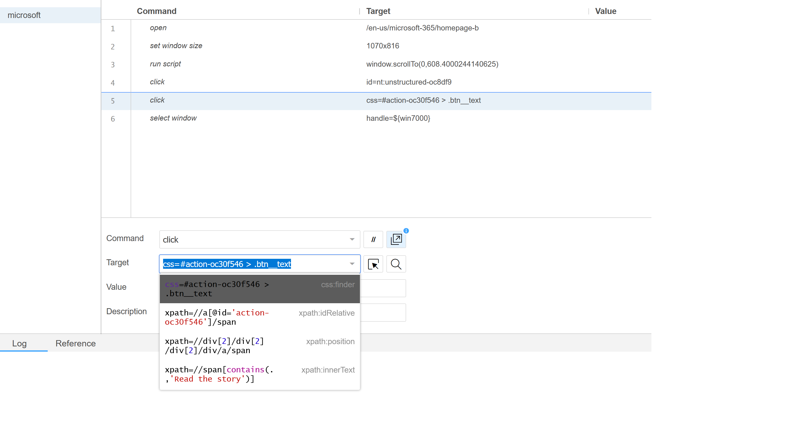
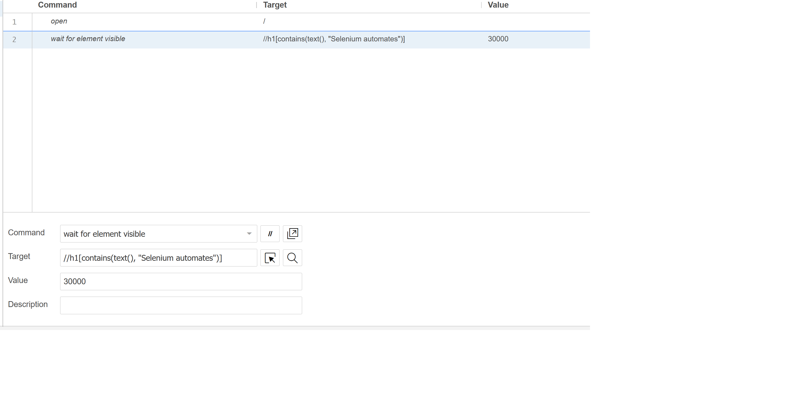

# Frequently Asked Questions
- [Frequently Asked Questions](#frequently-asked-questions)
  - [🌟 Why don't Selenium recorded scripts run successfully in Instana](#-why-dont-selenium-recorded-scripts-run-successfully-in-instana)
  - [🌟 How to resolve the issue of element is not clickable](#-how-to-resolve-the-issue-of-element-is-not-clickable)
      - [1. Scroll to view and click](#1-scroll-to-view-and-click)
      - [2. Using ActionChains](#2-using-actionchains)
      - [3. Using MouseOver in Selenium IDE script](#3-using-mouseover-in-selenium-ide-script)
  - [🌟 How to work with iframes and frames](#-how-to-work-with-iframes-and-frames)
  - [🌟 How to find one or more specific web elements](#-how-to-find-one-or-more-specific-web-elements)
  - [🌟 How to resolve no such element error](#-how-to-resolve-no-such-element-error)
  - [🌟 How to take a screenshot in Selenium IDE script](#-how-to-take-a-screenshot-in-selenium-ide-script)
  - [🌟 Is it possible to do a select in a BrowserScript test](#-is-it-possible-to-do-a-select-in-a-browserscript-test)
  - [🌟 How to handle Shadow DOM elements](#-how-to-handle-shadow-dom-elements)
  - [🌟 How to verify specific text in the page contents with partial matching](#-how-to-verify-specific-text-in-the-page-contents-with-partial-matching)


## 🌟 Why don't Selenium recorded scripts run successfully in Instana
This issue is usually because you have existed cookies and history data in your browsers, thus you can not see popup windows such as accept cookies in front of your website. To avoid this issue, you are recommended to use Instana [Synthetic-browser-script](https://www.npmjs.com/package/%40instana/synthetic-browser-script) local runner to test your script locally after creating test script. 

It can provide you the benefits:
* **Clear user profiles closer to end user experience** 
    
    Even though you can run your scripts successfully locally with Selenium IDE plugin, you may not run it successfully in Instana because of popup windows. Usually you need to close the popup window before your actions. The Synthetic-browser-script local runner will provide you clear user profiles as end user experience. And you can see what happened when full browser prompted and perform your script actions.
* **Instana extended browser testing APIs**
    
    If you would like to use [Instana extended browser testing APIs](https://www.ibm.com/docs/en/instana-observability/current?topic=beta-selenium-ide-scripts#expanding-testing-capabilities-in-selenium-ide-scripts), you can use the Synthetic-browser-script local runner to test it. It provides the same runtime as Instana Synthetic browser engine. 

## 🌟 How to resolve the issue of element is not clickable

This is a commonly asked questions. You may see your test failed with error message as `is not clickable at point (285,436) because another element <li> obscures it` or `Failed to execute command clickElement {} element not interactable`. To resolve this issue, you need to move your mouse to focus on the element. You can use the solutions as below:

#### 1. Scroll to view and click
This is a solution always works. You need to use JavaScript command to accomplish this. For Selenium IDE recorded script, you can use `runScript` or `executeScript` to call Instana extended APIs to use the same JavaScript code.

```javascript
let element = await $browser.findElement(By.xpath(`//a[contains(.,'Customer stories')]`)); 
await $browser.executeScript(`arguments[0].scrollIntoView()`, element); 
await $browser.executeScript(`arguments[0].click()`, element)											
```

Or for Selenium IDE script
```json
{
"id": "b345d354-1d95-45d0-81ab-7c78695ed040",
"comment": "",
"command": "runScript",
"target": "let element = await $browser.findElement(By.xpath(`//a[contains(.,'Customer stories')]`)); await $browser.executeScript(`arguments[0].scrollIntoView()`, element); await $browser.executeScript(`arguments[0].click()`, element)",
"targets": [],
"value": ""
}, 
```

#### 2. Using ActionChains
Using ActionChains to move to the element and click.
```javascript
let element = await $browser.waitForAndFindElement($driver.By.linkText(`Business to business (BtoB) activities`), 10000); 
await $browser.actions().move({origin: element}).click().perform();
```  

#### 3. Using MouseOver in Selenium IDE script
Selenium has a statement of the [MouseOver command](https://www.selenium.dev/selenium-ide/docs/en/introduction/faq#how-do-i-record-hovers).

```json
{
"id": "2d5c6b52-d2d7-4592-8052-87572a09e58b",
"comment": "",
"command": "mouseOver",
"target": "xpath=//dds-megamenu-category-link[contains(.,'Bridge observability and automated resource management')]",
"targets": [],
"value": ""
}, 
```
Actually MouseOver is parsed as following code. 
```javascript
await driver.wait(until.elementLocated(By.xpath(`//dds-megamenu-category-link[contains(.,\'Bridge observability and automated resource management\')]`)), configuration.timeout);
await driver.findElement(By.xpath(`//dds-megamenu-category-link[contains(.,\'Bridge observability and automated resource management\')]`))
.then(element => {
    return driver.actions({
      bridge: true
    }).move({
      origin: element
    }).perform();
  });
```

## 🌟 How to work with iframes and frames
Sometimes you might get a no such element error if your website using frames. To interact with the elements, we will need to first switch to the frame or iframe with `$browser.switchTo().frame(id: number | WebElement);`. In Instana Browser script test, you can use the code as below:
```javascript
let frameElement = await $browser.waitForAndFindElement($driver.By.xpath('//*[contains(@id, "pop-frame")]'), 10000);
await $browser.switchTo().frame(frameElement);
```

## 🌟 How to find one or more specific web elements
A reference from Selenium about [locator strategies](https://www.selenium.dev/documentation/webdriver/elements/locators/).
| Function                       | Description     |
| -------------------------- | ---------------------------------  |
|`$browser.waitForAndFindElement($driver.By.id("boxyear"), 1000)`| Wait and find element by ID until the element is visible or timeout value reached. | 
|`$browser.findElements($driver.By.css('select'))`| Search for multiple elements on the page with the CSS selector.| 
|`$browser.findElement($driver.By.linkText("About"))`| Find element by linkText|
|`$browser.findElement($driver.By.xpath('//input[@value='f']'))`| Find element by xpath|

More information provided as following about how to use XPath and CSS selector to help you move fast. 

The format of CSS selector `By.css(element[attribute='attribute-value'])`.

The format of XPath expression `By.xpath("//element[@attribute='value']")` or `By.xpath("//*[@attribute='value']")`

How to find an element by attributes e.g. `<a href="mysite.com"></a>`:

```javascript
// CSS selector
$driver.By.css(a[href*="example"] )
```
```javascript
// XPath expression
$driver.By.xpath("//a[contains(@href,'Electronics')]")
$driver.By.xpath(`//dds-footer-nav-item[contains(.,'Developer education')]`)
```

In the Selenium IDE plugin, you can choose different locators by clicking the target if you find the default one is not as goog as enough. 



## 🌟 How to resolve no such element error 
[Explicit wait](https://www.selenium.dev/documentation/webdriver/waits/#explicit-wait) is well known Selenium best practice to avoid the error of `no such element` and reduce unnecessary waiting or sleeping time. It is also recommended by Instana Synthetic especially compared with Implicit wait and `$browser.sleep`.

In Instana Synthetic, Explicit wait can be implemented as below examples:
```javascript
// wait until the title comes out
await $browser.wait($driver.until.titleContains('Year 2023 Calendar'), 10000);

// Call the wait function.
await $browser.wait(function () {
    return $browser.getTitle().then(function (title) {
      return title.includes("Google");
    });
  }, 10000);

await $browser.wait(async function () {
    const title = await $browser.getTitle();
    return title.includes("Google");
  }, 10000);

// waitForAndFindElement API
const cookies = await $browser.waitForAndFindElement(
    $driver.By.id(`truste-consent-button`),
    30000
);
await cookies.click();
```

In Selenium IDE script, you can use WAIT command as the example below:
```json
{
"id": "d13e50bd-f698-4a04-9420-701a21dcde8d",
"comment": "",
"command": "waitForElementPresent",
"target": "id=result-stats",
"targets": [
    ["id=result-stats", "id"],
    ["css=#result-stats", "css:finder"],
    ["xpath=//div[@id='result-stats']", "xpath:attributes"],
    ["xpath=//div[@id='slim_appbar']/div/div", "xpath:idRelative"],
    ["xpath=//div[7]/div/div/div/div/div", "xpath:position"]
],
"value": "10000"
}
```

## 🌟 How to take a screenshot in Selenium IDE script
You can use `runScript` or `executeScript` command in Selenium IDE scripts to call [Instana extended APIs](https://www.ibm.com/docs/en/instana-observability/current?topic=beta-selenium-ide-scripts#expanding-testing-capabilities-in-selenium-ide-scripts).
```json
{
"id": "e781c454-0080-447a-b905-7183443956f3",
"comment": "",
"command": "runScript",
"target": "await $browser.takeScreenshot()",
"targets": [],
"value": ""
}
```

## 🌟 Is it possible to do a select in a BrowserScript test
We do select as findElement and click 
```javascript
<select id="month" name="month" >
<option value="1">January</option>
<option value="2">February</option>
<option value="3">March</option>
...
</select>

// find element by css or xpath
await $browser.findElement($driver.By.css(`#month > option:nth-child(3)`)).click(); 
await $browser.findElement($driver.By.xpath(`//select[@id='month']/option[3]`)).click();

// wait until element located and do assertion
await $browser.wait($driver.until.elementLocated($driver.By.id("month")), 3000).click();
assert.equal(5, await $browser.findElement($driver.By.id("month")).getAttribute("value"));
await $browser.findElement($driver.By.xpath("//select[@id='month']/option[3]")).click();
assert.equal(3, await $browser.findElement($driver.By.id("month")).getAttribute("value"));
```

## 🌟 How to handle Shadow DOM elements
To access Shadow DOM elements, you can use the `getShadowRoot()` function. The new method is supported for Instana Synthetic PoP Helm chart 1.1.1 or later. You must upgrade your Synthetic PoP version to 1.1.1 or later to enable the support for Shadow DOM interaction.

```javascript
let shadowHost = await $browser.waitForAndFindElement(shadowHostSelector, timeout);
let shadowRoot = await shadowHost.getShadowRoot();
let element = await shadowRoot.findElement(elementSelector);
console.log("element text is:", await element.getText(), ", id is:", await element.getId());
```

## 🌟 How to verify specific text in the page contents with partial matching 
You can use findElement by XPath to verify specific text in your page with partial matching. 

* **Verify page content in Browser script test:**
```javascript
let element = await $browser.findElement(By.xpath(`//h1[contains(text(), 'Action Result')]`));
console.log("Found element:", await element.getTagName(), ", element text is:", await element.getText());

await $browser.waitForAndFindElement(By.xpath(`//label[contains(text(), 'Action Result')]`), 5000);
console.log(">>>>>>>>>>>>>>>>>>>", "Action Result found");
```

* **Verify page content in Selenium IDE recorded script test:**
```json
{
"id": "4cbe70ec-48b2-4e57-97cf-6d855fa0f08f",
"comment": "",
"command": "waitForElementVisible",
"target": "//h1[contains(text(), \"Selenium automates\")]",
"targets": [],
"value": "30000"
}
```
