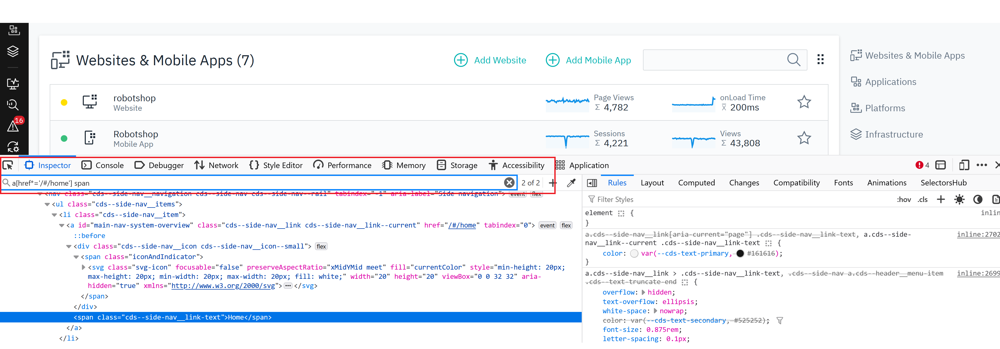

# Frequently Asked Questions
- [Frequently Asked Questions](#frequently-asked-questions)
  - [🌟 Why don't Selenium recorded scripts run successfully in Instana](#-why-dont-selenium-recorded-scripts-run-successfully-in-instana)
  - [🌟 How to resolve the issue of element is not clickable](#-how-to-resolve-the-issue-of-element-is-not-clickable)
      - [1. Scroll to view and click](#1-scroll-to-view-and-click)
      - [2. Using ActionChains](#2-using-actionchains)
      - [3. Using MouseOver in Selenium IDE script](#3-using-mouseover-in-selenium-ide-script)
  - [🌟 How to resolve StaleElementReferenceError](#-how-to-resolve-staleelementreferenceerror)
      - [1. Testing your locators can identify unique web element](#1-testing-your-locators-can-identify-unique-web-element)
      - [2. Locating the element again once it is attached to the DOM](#2-locating-the-element-again-once-it-is-attached-to-the-dom)
  - [🌟 How to work with iframes and frames](#-how-to-work-with-iframes-and-frames)
  - [🌟 How to find one or more specific web elements](#-how-to-find-one-or-more-specific-web-elements)
  - [🌟 How to resolve no such element error](#-how-to-resolve-no-such-element-error)
  - [🌟 How to take a screenshot in Selenium IDE script](#-how-to-take-a-screenshot-in-selenium-ide-script)
  - [🌟 Is it possible to do a select in a BrowserScript test](#-is-it-possible-to-do-a-select-in-a-browserscript-test)
  - [🌟 How to handle Shadow DOM elements](#-how-to-handle-shadow-dom-elements)
  - [🌟 How to verify specific text in the page contents with partial matching](#-how-to-verify-specific-text-in-the-page-contents-with-partial-matching)
  - [🌟 How to login with account enabled Two-factor authentication](#-how-to-login-with-account-enabled-two-factor-authentication)


## 🌟 Why don't Selenium recorded scripts run successfully in Instana
This issue is usually because you have existed cookies and history data in your browsers, thus you can not see popup windows such as accept cookies in front of your website. To avoid this issue, you are recommended to use Instana [Synthetic-browser-script](https://www.npmjs.com/package/%40instana/synthetic-browser-script) local runner to test your script locally after creating test script. 

It can provide you the benefits:
* **Clear user profiles closer to end user experience** 
    
    Even though you can run your scripts successfully locally with Selenium IDE plugin, you may not run it successfully in Instana because of popup windows. Usually you need to close the popup window before your actions. The Synthetic-browser-script local runner will provide you clear user profiles as end user experience. And you can see what happened when full browser prompted and perform your script actions.
* **Instana extended browser testing APIs**
    
    If you would like to use [Instana extended browser testing APIs](https://www.ibm.com/docs/en/instana-observability/current?topic=scripts-selenium-ide#expanding-testing-capabilities-in-selenium-ide-scripts), you can use the Synthetic-browser-script local runner to test it. It provides the same runtime as Instana Synthetic browser engine. 

Selenium IDE is one open source recording tool to help users to generate **locators** (CSS selectors, XPath, id etc.) easily to identify web elements. However it also has some limitations e.g. it requires some manual work to add Explicit Wait commands, scrolling, Shadow DOM accessing etc. And it can not report test failures sometimes such as [element is not attached to the page document, element not interactable](https://github.com/SeleniumHQ/selenium-ide/issues/996#issuecomment-1068719019) which is known issues that Selenium IDE sometimes is incompatible with script runners. You are recommended to test your script locally with [Synthetic-browser-script](https://www.npmjs.com/package/%40instana/synthetic-browser-script) local runner which is provided by Instana. With this tool, you can see the full browser UI prompted and perform your actions in the test scripts to help you debug and troubleshooting. If you have complex testing logic, such as loops, you can also try to use Instana Synthetic [browser script tests](https://www.ibm.com/docs/en/instana-observability/current?topic=scripts-browser), which is javascript based. About how to add these manual steps to support Shadow DOM etc., you can refer to [the FAQ](#frequently-asked-questions). 

## 🌟 How to resolve the issue of element is not clickable

This is a commonly asked questions. You may see your test failed with error message as `is not clickable at point (285,436) because another element <li> obscures it` or `Failed to execute command clickElement {} element not interactable`. To resolve this issue, you need to move your mouse to focus on the element. You can use the solutions as below:

#### 1. Scroll to view and click
This is a solution always works. You need to use JavaScript command to accomplish this. For Selenium IDE recorded script, you can use `runScript` or `executeScript` to call Instana extended APIs to use the same JavaScript code.

```javascript
let element = await $browser.waitForAndFindElement(By.xpath(`//a[contains(.,'Customer stories')]`), 30000); 
await $browser.executeScript(`arguments[0].scrollIntoView()`, element); 
await $browser.executeScript(`arguments[0].click()`, element)											
```

Or for Selenium IDE script
```json
{
"id": "b345d354-1d95-45d0-81ab-7c78695ed040",
"comment": "",
"command": "runScript",
"target": "let element = await $browser.waitForAndFindElement(By.xpath(`//a[contains(.,'Customer stories')]`), 30000); await $browser.executeScript(`arguments[0].scrollIntoView()`, element); await $browser.executeScript(`arguments[0].click()`, element)",
"targets": [],
"value": ""
}, 
```

#### 2. Using ActionChains
Using ActionChains to move to the element and click.
```javascript
let element = await $browser.waitForAndFindElement($driver.By.linkText(`Business to business (BtoB) activities`), 10000); 
await $browser.actions().move({origin: element}).click().perform();
```  

#### 3. Using MouseOver in Selenium IDE script
Selenium has a statement of the [MouseOver command](https://www.selenium.dev/selenium-ide/docs/en/introduction/faq#how-do-i-record-hovers).

```json
{
"id": "2d5c6b52-d2d7-4592-8052-87572a09e58b",
"comment": "",
"command": "mouseOver",
"target": "xpath=//dds-megamenu-category-link[contains(.,'Bridge observability and automated resource management')]",
"targets": [],
"value": ""
}, 
```
Actually MouseOver is parsed as following code. 
```javascript
await driver.wait(until.elementLocated(By.xpath(`//dds-megamenu-category-link[contains(.,\'Bridge observability and automated resource management\')]`)), configuration.timeout);
await driver.findElement(By.xpath(`//dds-megamenu-category-link[contains(.,\'Bridge observability and automated resource management\')]`))
.then(element => {
    return driver.actions({
      bridge: true
    }).move({
      origin: element
    }).perform();
  });
```

## 🌟 How to resolve StaleElementReferenceError
Sometimes you might encounter errors of `StaleElementReferenceError: stale element reference: element is not attached to the page document`. This is a common [selenium error](https://www.selenium.dev/documentation/webdriver/troubleshooting/errors/#stale-element-reference-exception) usually happening as your code in the test script might have a reference to a web element that is no longer attached to the DOM (e.g. when the web page uses React or Vue). For troubleshooting and solutions, you can refer to the examples below:
#### 1. Testing your locators can identify unique web element
This issue might be because your locator (CSS selectors, XPath, id etc. the expression in `Target` property in Selenium IDE) returns multiple web elements, and can not identify unique one. Following example is one actual case that the CSS locator `a[href*='/#/home'] span` returns multiple web elements, which leads to sometimes test failed because of stale element reference. To test your locators, you can input it in browser -> More tools -> Web Developer tools. The good locator can highlight unique web element you expected. If you see multiple results matched as screenshot below, you can update or change your locators.

You can also choose different locators with Selenium IDE by clicking on `Target` property. You are recommended to choose one meaningful locator not depending on the position of the web element. A good locator can identify an unique web element and not easily affected by window size or UI position adjustment. 


#### 2. Locating the element again once it is attached to the DOM
You can discard the current reference you hold and replace it, possibly by locating the element again once it is attached to the DOM. 

Besides the item 1, the possible reasons for the web element getting stale can be: 
- A page refresh
- DOM update
- Location of the web element being changed

The two most usual reasons for the StaleElementReferenceError are that:
- The selected web element to be interacted with is no longer present on the HTML web page
- The selected web element was destroyed completely and recreated.

Example code with StaleElementReferenceError:
```javascript
// retrieving an input HTML element from the page
let nameHtmlElement = await $browser.findElement(nameInputBy);
// setting a name in the input element
await nameHtmlElement.sendKeys("John");

// refreshing the page
await $browser.navigate().refresh()

// nameHtmlElement is now stale
// trying to set a new name, but this will throw a StaleElementReferenceException
await nameHtmlElement.sendKeys("Maria");
```

The possible solution is to find the element again before you use it.
```javascript
// refreshing the page
await $browser.navigate().refresh()
nameHtmlElement = await $browser.findElement(nameInputBy);
await nameHtmlElement.sendKeys("Maria");
```
Some users use try-catch-retry solutions. You can try to use Instana provided Retry Strategy by setting retry to 1 or 2 times from Instana test configuration UI dashboard. The Instana Retry Strategy will retry your test script at most 1 or 2 times until your test result is successful before sending the test result to Instana backend. Or you can search this `StaleElementReferenceError` to find more solutions in the browser testing field to address it in your test script code.


## 🌟 How to work with iframes and frames
Sometimes you might get a no such element error if your website using frames. To interact with the elements, we will need to first switch to the frame or iframe with `$browser.switchTo().frame(id: number | WebElement);`. In Instana Browser script test, you can use the code as below:
```javascript
let frameElement = await $browser.waitForAndFindElement($driver.By.xpath('//*[contains(@id, "pop-frame")]'), 10000);
await $browser.switchTo().frame(frameElement);
```

## 🌟 How to find one or more specific web elements
A reference from Selenium about [locator strategies](https://www.selenium.dev/documentation/webdriver/elements/locators/).
| Function                       | Description     |
| -------------------------- | ---------------------------------  |
|`$browser.waitForAndFindElement($driver.By.id("boxyear"), 1000)`| Wait and find element by ID until the element is visible or timeout value reached. | 
|`$browser.findElements($driver.By.css('select'))`| Search for multiple elements on the page with the CSS selector.| 
|`$browser.findElement($driver.By.linkText("About"))`| Find element by linkText|
|`$browser.findElement($driver.By.xpath('//input[@value='f']'))`| Find element by xpath|

More information provided as following about how to use XPath and CSS selector to help you move fast. 

The format of CSS selector `By.css(element[attribute='attribute-value'])`.

The format of XPath expression `By.xpath("//element[@attribute='value']")` or `By.xpath("//*[@attribute='value']")`

How to find an element by attributes e.g. `<a href="mysite.com"></a>`:

```javascript
// CSS selector
$driver.By.css(a[href*="example"] )
```
```javascript
// XPath expression
$driver.By.xpath("//a[contains(@href,'Electronics')]")
$driver.By.xpath(`//dds-footer-nav-item[contains(.,'Developer education')]`)
```

In the Selenium IDE plugin, you can choose different locators by clicking the target if you find the default one is not as good as enough. 


## 🌟 How to resolve no such element error 
[Explicit wait](https://www.selenium.dev/documentation/webdriver/waits/#explicit-wait) is well known Selenium best practice to avoid the error of `no such element` and reduce unnecessary waiting or sleeping time. It is also recommended by Instana Synthetic especially compared with Implicit wait and `$browser.sleep`.

In Instana Synthetic, Explicit wait can be implemented as below examples:
```javascript
// wait until the title comes out
await $browser.wait($driver.until.titleContains('Year 2023 Calendar'), 10000);

// Call the wait function.
await $browser.wait(function () {
    return $browser.getTitle().then(function (title) {
      return title.includes("Google");
    });
  }, 10000);

await $browser.wait(async function () {
    const title = await $browser.getTitle();
    return title.includes("Google");
  }, 10000);

// waitForAndFindElement API
const cookies = await $browser.waitForAndFindElement(
    $driver.By.id(`truste-consent-button`),
    30000
);
await cookies.click();
```

In Selenium IDE script, you can use WAIT command as the example below:
```json
{
"id": "d13e50bd-f698-4a04-9420-701a21dcde8d",
"comment": "",
"command": "waitForElementPresent",
"target": "id=result-stats",
"targets": [
    ["id=result-stats", "id"],
    ["css=#result-stats", "css:finder"],
    ["xpath=//div[@id='result-stats']", "xpath:attributes"],
    ["xpath=//div[@id='slim_appbar']/div/div", "xpath:idRelative"],
    ["xpath=//div[7]/div/div/div/div/div", "xpath:position"]
],
"value": "10000"
}
```

## 🌟 How to take a screenshot in Selenium IDE script
You can use `runScript` or `executeScript` command in Selenium IDE scripts to call [Instana extended APIs](https://www.ibm.com/docs/en/instana-observability/current?topic=scripts-selenium-ide#expanding-testing-capabilities-in-selenium-ide-scripts).
```json
{
"id": "e781c454-0080-447a-b905-7183443956f3",
"comment": "",
"command": "runScript",
"target": "await $browser.takeScreenshot()",
"targets": [],
"value": ""
}
```

## 🌟 Is it possible to do a select in a BrowserScript test
We do select as findElement and click 
```javascript
<select id="month" name="month" >
<option value="1">January</option>
<option value="2">February</option>
<option value="3">March</option>
...
</select>

// find element by css or xpath
await $browser.findElement($driver.By.css(`#month > option:nth-child(3)`)).click(); 
await $browser.findElement($driver.By.xpath(`//select[@id='month']/option[3]`)).click();

// wait until element located and do assertion
await $browser.wait($driver.until.elementLocated($driver.By.id("month")), 3000).click();
assert.equal(5, await $browser.findElement($driver.By.id("month")).getAttribute("value"));
await $browser.findElement($driver.By.xpath("//select[@id='month']/option[3]")).click();
assert.equal(3, await $browser.findElement($driver.By.id("month")).getAttribute("value"));
```

## 🌟 How to handle Shadow DOM elements
To access Shadow DOM elements, you can use the `getShadowRoot()` function. The new method is supported for Instana Synthetic PoP Helm chart 1.1.1 or later. You must upgrade your Synthetic PoP version to 1.1.1 or later to enable the support for Shadow DOM interaction.

```javascript
let shadowHost = await $browser.waitForAndFindElement(shadowHostSelector, timeout);
let shadowRoot = await shadowHost.getShadowRoot();
let element = await shadowRoot.findElement(elementSelector);
console.log("element text is:", await element.getText(), ", id is:", await element.getId());
```

## 🌟 How to verify specific text in the page contents with partial matching 
You can use findElement by XPath to verify specific text in your page with partial matching. 

* **Verify page content in Browser script test:**
```javascript
let element = await $browser.findElement(By.xpath(`//h1[contains(text(), 'Action Result')]`));
console.log("Found element:", await element.getTagName(), ", element text is:", await element.getText());

await $browser.waitForAndFindElement(By.xpath(`//label[contains(text(), 'Action Result')]`), 5000);
console.log(">>>>>>>>>>>>>>>>>>>", "Action Result found");
```

* **Verify page content in Selenium IDE recorded script test:**
```json
{
"id": "4cbe70ec-48b2-4e57-97cf-6d855fa0f08f",
"comment": "",
"command": "waitForElementVisible",
"target": "//h1[contains(text(), \"Selenium automates\")]",
"targets": [],
"value": "30000"
}
```


## 🌟 How to login with account enabled Two-factor authentication
Instana Synthetic provides a solution to support 2FA (two-factor authentication) when logging in websites in both BrowserScript and Selenium SIDE script tests. You can follow steps below to pass 2FA. For the complete test script, see [BrowserScript example](../examples/browserscripts/test_login_2fa.js) and [Selenium SIDE example](../examples/side/test-login-2fa.side). To local test local run, replace the variables of `url` and `$secure` in `synb.json` with actual values.

1. Get the TOTP key that will be provided to create the TOTP token to login with 2FA (choosing the **Can't scan the QR code** option or **Problem scanning? enter a code instead**).
2. Create a Synthetic Credential for TOTP key using the [Instana Open API](https://instana.github.io/openapi/#operation/createSyntheticCredential).
3. Then in your browser test, you can use the browser testing API of `$browser.generateTOTPToken(key: string)` to create a time-based TOTP token whenever you need to input it. 
* To use BrowserScript to login with 2FA
    ```javascript 
    let totp_token = $browser.generateTOTPToken($secure.totpKey);
    await findElementByIdAndSendKeys("password", totp_token);
    ```
* To use Selenium SIDE script to login with 2FA
    ```json
    {
        "id": "ec51296b-4d16-4167-ac83-ba87f89cc0c7",
        "comment": "Generate a TOTP token from a TOTP key",
        "command": "executeScript",
        "target": "return $browser.generateTOTPToken($secure.totpKey);",
        "targets": [],
        "value": "totpToken"
    }, {
        "id": "3cbc306a-ed33-46bf-9923-92752b0466f2",
        "comment": "",
        "command": "type",
        "target": "id=password",
        "targets": [],
        "value": "${totpToken}"
    },
    ```
